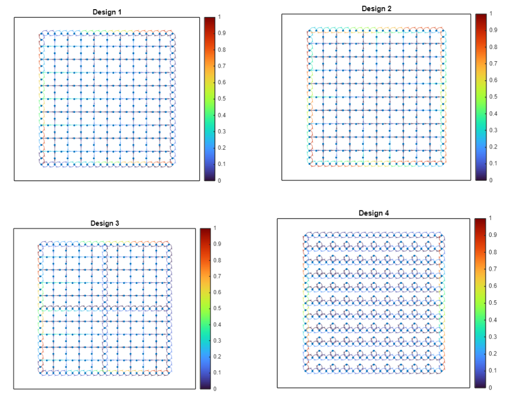

# Transport-coursework

All code used to generate solutions to Transport and Mobility Modelling coursework. I used a mixture of MATLAB and Python. The assignment instructions can be found in "TMM2024CourseworkAssignment.pdf".

**Example figures and results for each question**

Question 1 - Demand Modelling

*Figure 1: Comparing demand models*

*Figure 2: Mapping UTLA centres*

Question 2 - Network Modelling

*Figure 3: Traffic flow on varying LTN designs*

Question 3 - Assignment Modelling

*Figure 4: Visualising network flows under varying demand*

Question 4 - Microscopic Modelling

*Figure 5: Modelling free flow of cars on a road*

*Figure 6: Modelling traffic light situation*

Question 5 - Data-driven Modelling

*Figure 7: Time-series model components*

*Figure 8: Applying centrality measures*

Question 6 - Practitioner Studies

*Figure 9: Pedestrian Models Overview*

*Figure 10: Model applied in this scenario*